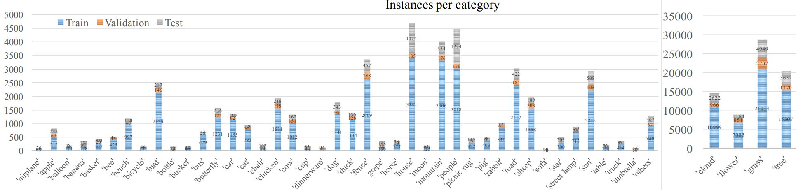

# SketchyScene: Richly-Annotated Scene Sketches.

Data collection and model training code for ["SketchyScene: Richly-Annotated Scene Sketches
"](http://openaccess.thecvf.com/content_ECCV_2018/papers/Changqing_Zou_SketchyScene_Richly-Annotated_Scene_ECCV_2018_paper.pdf)

## Dataset

[7265 Samples (train 5617 + val 535 + test 1113)](https://drive.google.com/open?id=1m1fac2XIZVAGu_ByE6BtwxGSLytZspO-)

[Selected Synthesized Samples (3 from 30 synthesize examples for each template)](https://drive.google.com/drive/folders/1x7DiyTlpEFb_fydOyjL48wnvREQO1u1d?usp=sharing)

[Overall Synthesized Samples (30 synthesize examples for each template)](https://drive.google.com/drive/folders/15TWNXFOKoB0dKkOaDofFgLJ_9JuxgStm?usp=sharing)


## USketch

**USketch** is a web-driven tool for crowdsourcing the **SketchyScene** dataset. It is open-sourced at https://github.com/ruofeidu/USketch. A live demo is located at http://duruofei.com/skenew/?task=1.

, component display (lower left), and canvas (right). ")


## DuCrawler

In preparation for the reference data in **USketch**, we have developed a custom image crawler to acquire 7,500 cartoon scenes and 9,290 sketchy objects in 45 categories for academic use. Due to the length limitation, we explain the detailed crawling process and source code in the supplementary materials.



We selected 45 categories for our dataset, including objects and stuff classes. Specifically, we first considered several common scenes (e.g., garden, farm, dinning room, and park) and extracted 100 objects/stuff classes from them as raw candidates. Then we defined three super-classes, i.e. Weather, Object, and Field (Environment), and assigned the candidates into each super-class. Finally, we selected 45 from them by considering their combinations and commonness in real life. 

Instead of asking workers to draw each object, we provided them with plenty of object sketches (each object candidate is also refer to a ``component") as candidates. In order to have enough variations in the object appearance in terms of pose and appearance, we searched and downloaded around 1,500 components for each category. 

## Semantic Segmentation

The code under `Semantic_Segmentation` is for the semantic segmentation experiments of our SketchyScene dataset.

### Requirements

- Python 3
- Tensorflow (>= 1.0.0)
- Numpy
- PIL (Pillow version = 2.3.0)
- [pydensecrf](https://github.com/lucasb-eyer/pydensecrf)

### Preparations

- Download the whole dataset and place them under `data` directory following its instructions.
- Generate the ImageNet pre-trained "ResNet-101" model in TensorFlow version for initial training and place it under the `resnet_pretrained_model` directory. This can be obtained following the instructions in [chenxi116/TF-resnet](https://github.com/chenxi116/TF-resnet#example-usage). For convenience, you can download our converted model [here](https://drive.google.com/file/d/1Z72Iv3OobWv-tYoUwvY_7HMgsLUGKkcp/view?usp=sharing). 

### Training

After the preparations, run:

```
python3 segment_main.py --mode=train
```

Also, you can modify the training parameters in `configs.py`


### Evaluation

Evaluation can be done with `val` and `test` dataset. Make sure that your trained tfmodel is under the directory `Semantic_Segmentation/outputs/snapshot`. [DenseCRF](https://github.com/lucasb-eyer/pydensecrf) can be used to improve the segmentation performance as a post-processing skill.

For evaluation under `val`/`test` dataset without DenseCRF, run:
```
python3 segment_main.py --mode='val' --dcrf=0
python3 segment_main.py --mode='test' --dcrf=0
```

- DenseCRF is used if setting `--dcrf=1`

Our trained model can be download [here](https://drive.google.com/file/d/1Z72Iv3OobWv-tYoUwvY_7HMgsLUGKkcp/view?usp=sharing).


### Inference

You can obtain a semantic segmentation output during inference. Inference can be done with `val` and `test` dataset.

For inference with the 2nd image in `val` dataset without DenseCRF, which the background is white, run:

```
python3 segment_main.py --mode='inference' --infer_dataset='val' --image_id=2 --black_bg=0  --dcrf=0
```

- Inference under `test` dataset if setting `--infer_dataset='test'`
- Try other image if setting `--image_id` to other number
- The background is black if setting `--black_bg=1`. Otherwise, it is white.
- DenseCRF is used if setting `--dcrf=1`

Also, you can try [our trained model](https://drive.google.com/file/d/1Z72Iv3OobWv-tYoUwvY_7HMgsLUGKkcp/view?usp=sharing).


### Visualization

You can visualize the ground-truth semantic results with the `.mat` data using `tools/semantic_visualize.py`. **Note** that the data should be correctly arranged following the instructions under `data` directory.

For visualization with the 1st/2nd image in `train` dataset, run:

```
python3 semantic_visualize.py --dataset='train' --image_id=1 --black_bg=1
python3 semantic_visualize.py --dataset='train' --image_id=2 --black_bg=0
```

- Visualization under `val`/`test` dataset if setting `--dataset='val'` or `--dataset='test'`
- Try other image if setting `--image_id` to other number
- The background is black if setting `--black_bg=1` and white if `--black_bg=0`.


## Citation

Please cite the corresponding paper if you found our datasets or code useful:

```
@inproceedings{ZouSketchyScene,
  author    = {Changqing Zou and
                Qian Yu and
                Ruofei Du and
                Haoran Mo and
                Yi-Zhe Song and
                Tao Xiang and
                Chengying Gao and
                Baoquan Chen and
                Hao Zhang},
  title     = {SketchyScene: Richly-Annotated Scene Sketches},
  booktitle = {ECCV},
  year      = {2018}
}
```

## Credits
- ResNet-101 model pre-trained on ImageNet in TensorFlow version by [chenxi116](https://github.com/chenxi116/TF-resnet)
- Code for DeepLab model by [Tensorflow Authors](https://github.com/tensorflow/models/blob/master/research/resnet/resnet_model.py) and [chenxi116](https://github.com/chenxi116/TF-deeplab)
